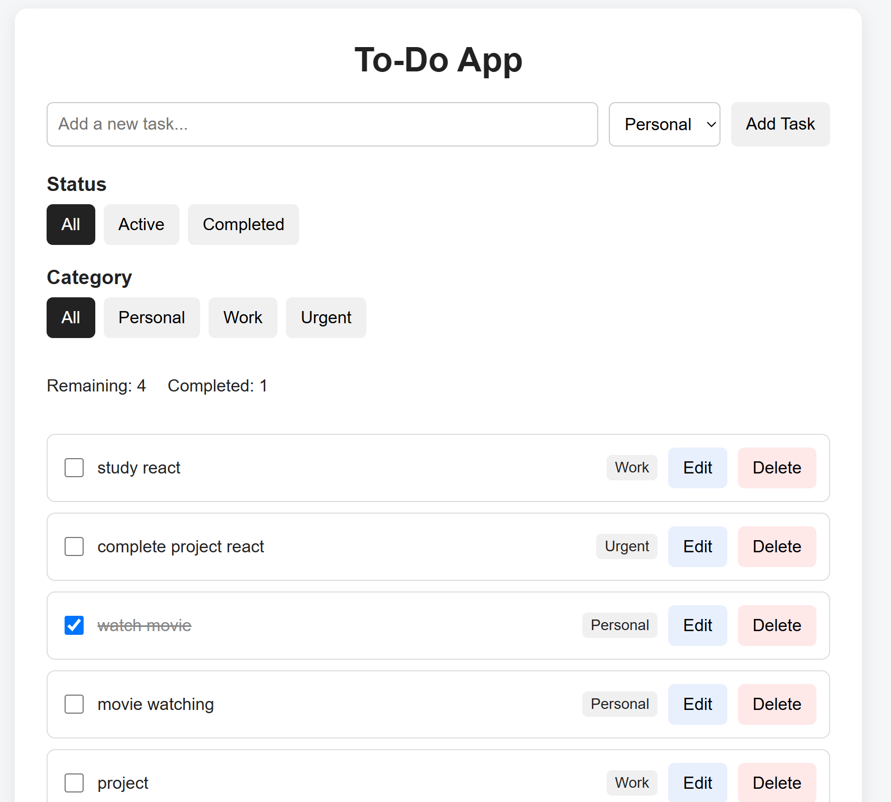
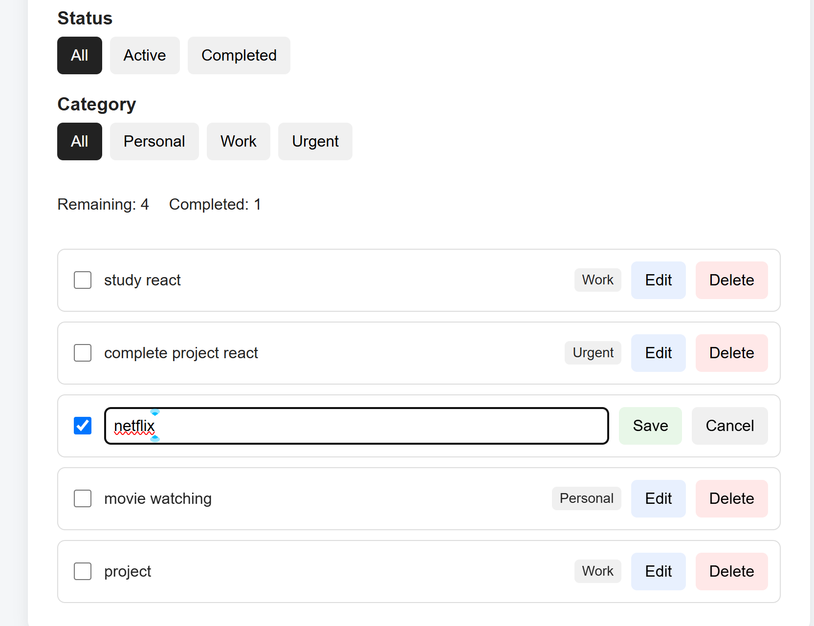
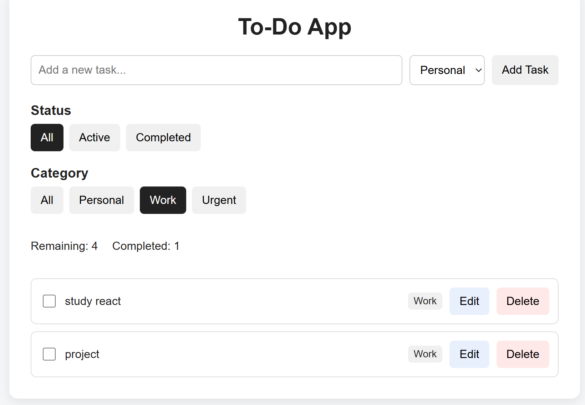

# Personal Task Manager

A simple and responsive To-Do application built with React. The application allows users to create, edit, delete, complete, and filter tasks while saving tasks in the browser using localStorage.

## Features

- Add new tasks
- Assign tasks to Personal, Work, or Urgent categories
- Mark tasks as completed
- Edit existing tasks
- Delete tasks
- Filter tasks by status:
  - All
  - Active
  - Completed
- Filter tasks by category:
  - All
  - Personal
  - Work
  - Urgent
- Display remaining and completed task counts
- Save tasks using browser localStorage
- Responsive layout for smaller screens
- Simple and user-friendly interface

## Technologies Used

- React
- JavaScript
- HTML
- CSS
- Vite
- Browser localStorage
- Git
- GitHub

## React Concepts Used

This project demonstrates several core React concepts:

- Functional components
- `useState`
- `useEffect`
- Props
- Event handling
- Controlled form inputs
- Conditional rendering
- List rendering with `.map()`
- Unique keys
- Component-based structure

## Project Structure

```text
todo-app/
├── node_modules/
├── public/
├── Screenshots/
│   ├── filtering.png
│   ├── main_app.png
│   └── task_management.png
├── src/
│   ├── assets/
│   ├── components/
│   │   ├── TaskForm.jsx
│   │   └── TaskList.jsx
│   ├── App.css
│   ├── App.jsx
│   ├── index.css
│   └── main.jsx
├── .gitignore
├── package.json
├── package-lock.json
├── README.md
└── vite.config.js

Main Components
App

The main application component manages the overall task state, filtering, task counts, and localStorage functionality.

TaskForm

Handles the task creation form. Users can enter a task and select a category before adding it to the task list.

TaskList

Displays the tasks and passes the required task information and functions to each task item.

TaskItem

Handles individual task interactions such as completing, editing, saving, cancelling edits, and deleting a task.

Getting Started
Prerequisites

You can check the installed versions using:
node -v
npm -v

Installation
Clone the repository:
git clone https://github.com/sharma-bikash/todo-app.git

Move into the project directory:
cd todo-app

Install the required dependencies:
npm install

Run the Application
Start the development server:
npm run dev

The application will normally be available at:
http://localhost:5173/
Open the address in your web browser to use the application.

How It Works
Adding a Task
Enter a task in the input field.
Select a category.
Click Add Task.
The task appears in the task list.
Completing a Task

Click the checkbox next to a task to change its status between active and completed.

Completed tasks are displayed with a line through the task text.

Editing a Task
Click the Edit button.
Modify the task text.
Click Save to save the changes.
Click Cancel to cancel the edit.
Deleting a Task

Click the Delete button to remove a task from the list.

Filtering Tasks

Tasks can be filtered by status:

All
Active
Completed

Tasks can also be filtered by category:

All
Personal
Work
Urgent
Task Counts

The application displays:

The number of remaining tasks
The number of completed tasks
Data Persistence

The application uses the browser's localStorage to save tasks.

This means tasks remain available when the page is refreshed in the same browser.

## Screenshots

### Main Application



### Task Management



### Filtering



Known Limitations
Tasks are stored only in the browser's localStorage.
Tasks are not synchronized between different devices or browsers.
There is no user authentication or online database.
Drag-and-drop task ordering is not currently implemented.
Due dates and reminders are not currently included.
Future Improvements

Possible future improvements include:

Drag-and-drop task ordering
Due dates
Task reminders
Dark and light theme switching
User authentication
Cloud database storage
Synchronisation between devices
Additional task categories
Search functionality
Git and Version Control

The project was developed using Git and GitHub.

The development process was divided into meaningful commits to track the implementation of different features, including:

Initial React project setup
Task form and task state
Task list
Task completion and deletion
Task editing
Category filtering
Status filtering and task counts
Local storage persistence
Responsive styling
Project documentation
Author

Developed as a React course project.

License

This project was created for educational purposes.


